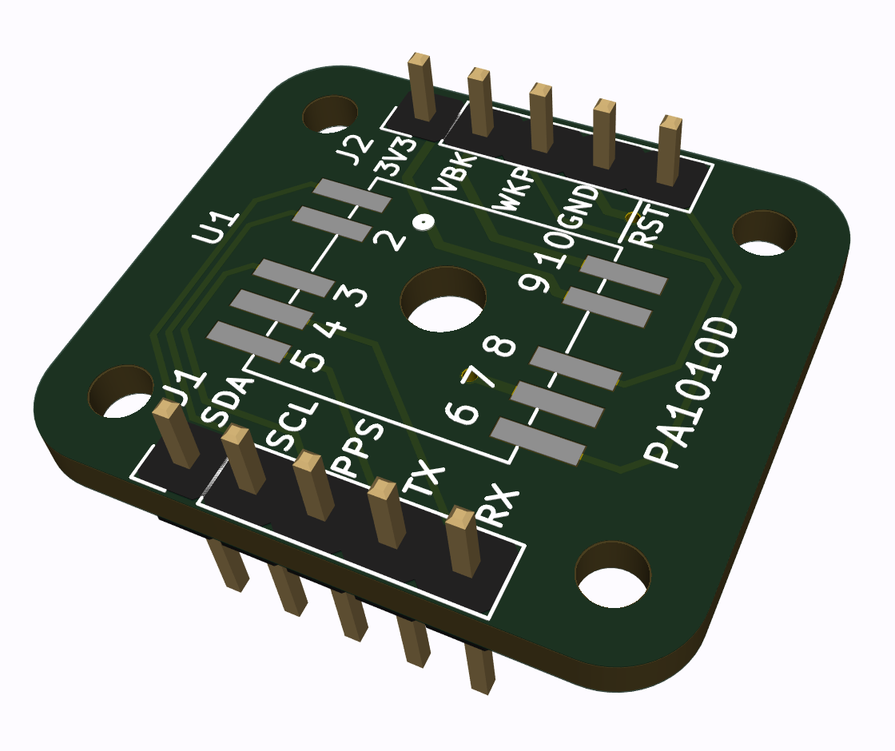
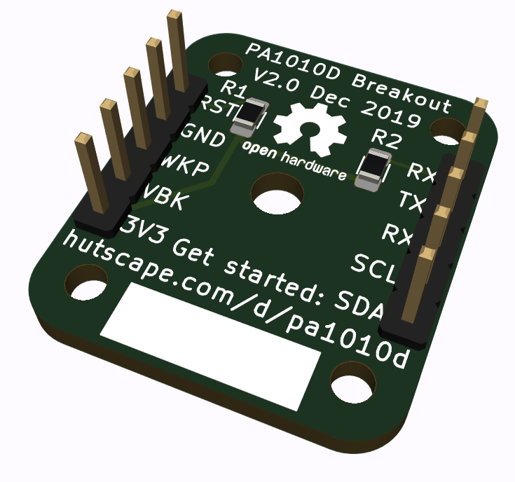
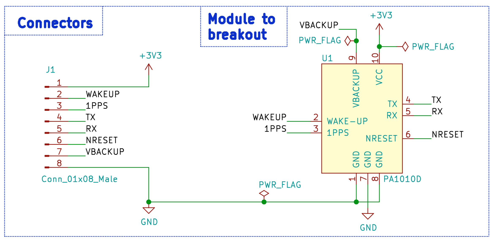
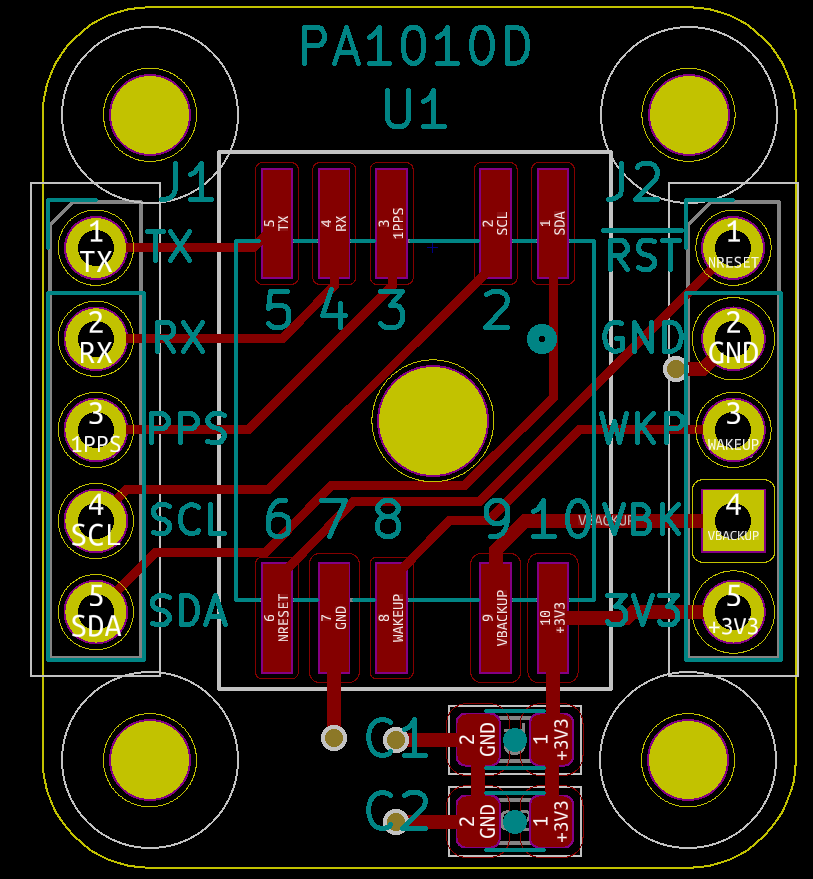
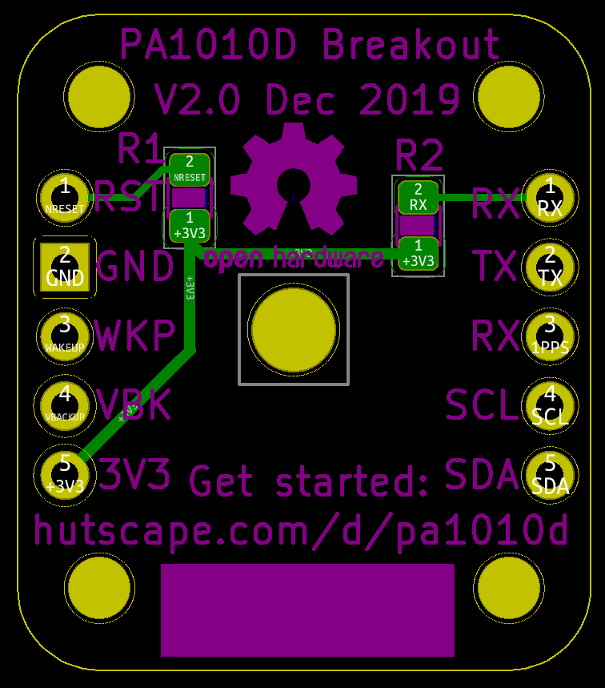

# PA1010D GPS Module Breakout board

> The PA1010D module from CDTop is the world’s smallest GNSS module with an integrated antenna, measuring only 10x10x6.8 mm. This repository contains the schematic and layout for a breadboard-able breakout board!

## Getting Started

Download the KiCad file to edit the schematic and layout: `pa1010d-breakout.pro`.

## Schematic

## Layout

Front

Back

## References

1. [CDTop PA1010D](https://www.cdtop-tech.com/products/pa1010d)
1. [PA1010D Datasheet](https://drive.google.com/file/d/1O-9RGAwgs2fgtnzJRBa9eB1fAqJt7n_k/view)
1. [Adafruit Mini GPS PA1010D](https://www.adafruit.com/product/4415)
1. [Mediatek MT3333](https://labs.mediatek.com/en/chipset/MT3333)
